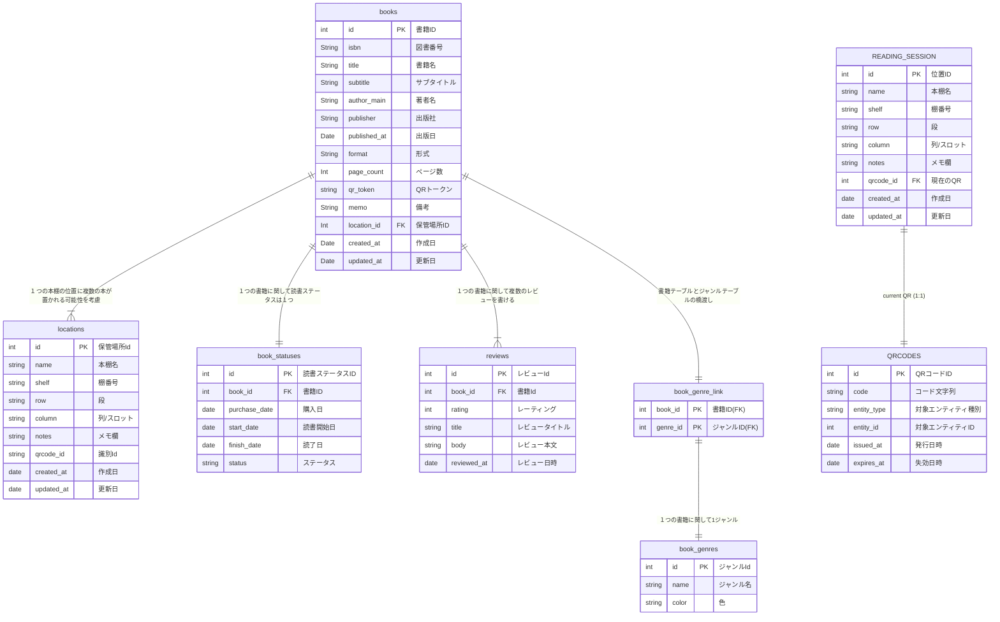

## データベース設計

## テーブル一覧

* 書籍テーブル　books

| No  | 論理名       | 物理名       | 型     | 桁数 | NotNull | PK  | FK  | 備考                                  | 
| --- | ------------ | ------------ | ------ | ---- | ------- | --- | --- | ------------------------------------- | 
| 1   | 書籍Id       | id           | int    |      |         | 〇  |     |                                       | 
| 2   | 図書番号     | isbn         | string | 20   |         |     |     |                                       | 
| 3   | 書籍名       | title        | string | 255  | 〇      |     |     |                                       | 
| 4   | サブタイトル | subtitle     | string | 255  |         |     |     |                                       | 
| 5   | 著者名       | author_main  | string | 255  |         |     |     | 1カラムで複数の著者管理。将来的に拡張 | 
| 6   | 出版社       | publisher    | string | 255  |         |     |     |                                       | 
| 7   | 出版日       | published_at | date   |      |         |     |     |                                       | 
| 8   | 形式         | format       | string | 50   |         |     |     | enum: paper, ebook, audio…           | 
| 9   | ページ数     | page_count   | int    |      |         |     |     |                                       | 
| 10   | QRトークン     | qr_token   | int    |      |         |     |     |                                       |
| 11  | 備考         | memo         | string |      |         |     |     |                                       | 
| 12  | 保管場所     | location_id  | int    |      |         |     | 〇  |                                       | 
| 13  | 作成日       | created_at   | date   |      |         |     |     | デフォルト：現在日付                  | 
| 14  | 更新日       | updated_at   | date   |      |         |     |     | デフォルト：現在日付                  | 

* book_statuses（読書ステータス）

| No  | 論理名                 | 物理名        | 型     | 桁数 | NotNull | PK  | FK  | idx | 備考                                              | 
| --- | ---------------------- | ------------- | ------ | ---- | ------- | --- | --- | --- | ------------------------------------------------- | 
| 1   | 読書ステータスId       | id            | int    |      |         | 〇  |     |     |                                                   | 
| 2   | 書籍Id                 | book_id       | int    |      |         |     | 〇  | 〇  |                                                   | 
| 3   | 購入日                 | purchase_date | date   |      |         |     |     |     |                                                   | 
| 4   | 読書開始日             | start_date    | date   |      |         |     |     | 〇  |                                                   | 
| 5   | 読了日                 | finish_date   | date   |      |         |     |     |     |                                                   | 
| 6   | ステータス             | status        | string |      |         |     |     | 〇  | enum: backlog, reading, paused, finished, dropped | 

* reviews（感想・レビュー）

| No  | 論理名                 | 物理名        | 型     | 桁数 | NotNull | PK  | FK  | idx | 備考                                              | 
| --- | ---------------------- | ------------- | ------ | ---- | ------- | --- | --- | --- | ------------------------------------------------- | 
| 1   | レビューId             | id            | int    |      |         | 〇  |     |     |                                                   | 
| 2   | 書籍Id                 | book_id       | int    |      |         |     | 〇  | 〇  |                                                   | 
| 3   | レーティング           | rating        | int    | 5    |         |     |     | 〇  |                                                   | 
| 4   | レビュータイトル       | title         | string | 255  |         |     |     |     |                                                   | 
| 5   | レビュー本文           | body          | string | 500  |         |     |     |     |                                                   | 
| 6   | レビュー日時           | reviewed_at   | date   |      |         |     |     |     |                                                   | 

* locations（位置情報 棚・段・列）

| No  | 論理名                 | 物理名        | 型     | 桁数 | NotNull | PK  | FK  | idx | 備考                                              | 
| --- | ---------------------- | ------------- | ------ | ---- | ------- | --- | --- | --- | ------------------------------------------------- | 
| 1   | 保管場所Id             | id            | int    |      |         | 〇  |     |     |                                                   | 
| 2   | 本棚名                 | name          | string | 255  | 〇      |     |     |     |                                                   | 
| 3   | 棚番号                 | shelf         | string | 50   |         |     |     |     |                                                   | 
| 4   | 段                     | row           | string | 50   |         |     |     |     |                                                   | 
| 5   | 列/スロット            | column        | string | 50   |         |     |     |     |                                                   | 
| 6   | メモ欄                 | notes         | string | 50   |         |     |     |     |                                                   | 
| 7   | 識別Id                 | qrcode_id     | string | 50   |         |     |     |     | 棚に貼るQRコードの識別子　UNIQUE                  | 
| 8   | 作成日                 | created_at    | date   |      |         |     |     |     | デフォルト：現在日付                              | 
| 9   | 更新日                 | updated_at    | date   |      |         |     |     |     | デフォルト：現在日付                              | 

* book_genres（書籍ジャンル）

| No  | 論理名                 | 物理名        | 型     | 桁数 | NotNull | PK  | FK  | idx | 備考                                              | 
| --- | ---------------------- | ------------- | ------ | ---- | ------- | --- | --- | --- | ------------------------------------------------- | 
| 1   | ジャンルId             | id            | int    |      |         | 〇  |     |     |                                                   | 
| 2   | ジャンル名             | name          | string |      | 〇      |     |     |     | UNIQUE                                            | 
| 3   | 色                     | color         | string |      |         |     |     |     | UI用                                              | 

* book_genre_link（書籍ジャンルリンク）

| No  | 論理名                 | 物理名        | 型     | 桁数 | NotNull | PK  | FK  | idx | 備考                                              | 
| --- | ---------------------- | ------------- | ------ | ---- | ------- | --- | --- | --- | ------------------------------------------------- | 
| 1   | 書籍Id                 | book_id       | int    |      |         | 〇  | 〇  |     |                                                   | 
| 2   | ジャンルId             | genre_id      | int    |      |         | 〇  | 〇  |     |                                                   | 

* reading_session（読書情報）

| No  | 論理名                 | 物理名        | 型     | 桁数 | NotNull | PK  | FK  | idx | 備考                                              | 
| --- | ---------------------- | ------------- | ------ | ---- | ------- | --- | --- | --- | ------------------------------------------------- | 
| 1   | Id                     | id            | int    |      |         | 〇  |     |     |                                                   | 
| 2   | 本棚名                 | name          | string | 255  | 〇      |     |     |     |                                                   | 
| 3   | 棚番号                 | shelf         | string | 50   |         |     |     |     |                                                   | 
| 4   | 段                     | row           | string | 50   |         |     |     |     |                                                   | 
| 5   | 列/スロット            | column        | string | 50   |         |     |     |     |                                                   | 
| 6   | メモ欄                 | notes         | string | 50   |         |     |     |     |                                                   | 
| 7   | 識別Id                 | qrcode_id     | string | 50   |         |     | 〇  |     | 棚に貼るQRコードの識別子　UNIQUE                  | 
| 8   | 作成日                 | created_at    | date   |      |         |     |     |     | デフォルト：現在日付                              | 
| 9   | 更新日                 | updated_at    | date   |      |         |     |     |     | デフォルト：現在日付                              | 

* qrcodes（Qrコード）

| No  | 論理名                 | 物理名        | 型     | 桁数 | NotNull | PK  | FK  | idx | 備考                                              | 
| --- | ---------------------- | ------------- | ------ | ---- | ------- | --- | --- | --- | ------------------------------------------------- | 
| 1   | QRコードId             | id            | int    |      |         | 〇  |     |     |                                                   | 
| 2   | コード文字列           | code          |        |      |         |     |     |     | 実際に印字・エンコードする値（URL/トークン等）    | 
| 3   | 対象のエンティティ種別 | entity_type   |        |      |         |     |     |     | 例：reading_session / book / location             | 
| 4   | 対象エンティティId     | entity_id     |        |      |         |     |     |     | 紐づく対象の主キー                                | 
| 5   | 発行日時               | issued_at     |        |      |         |     |     |     | コード発行時刻                                    | 
| 6   | 失効日時               | expires_at    |        |      |         |     |     |     | 期限（NULL=無期限                                 | 

